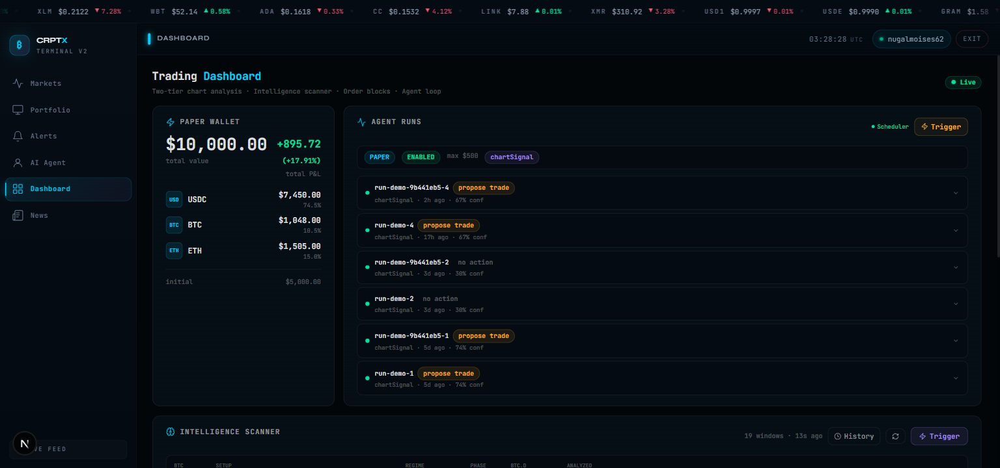
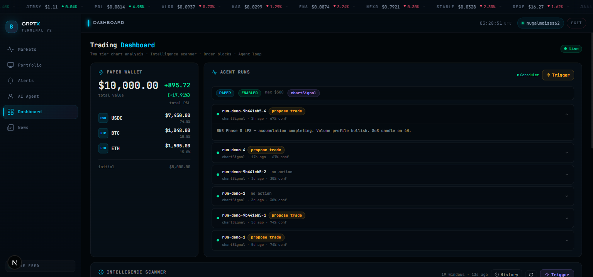
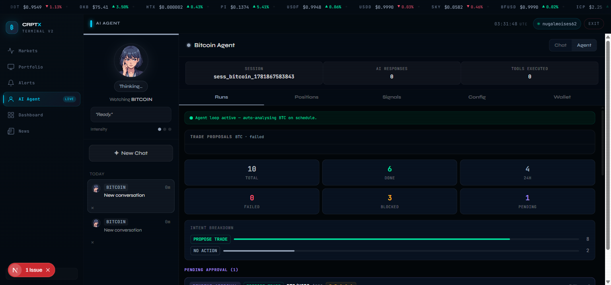
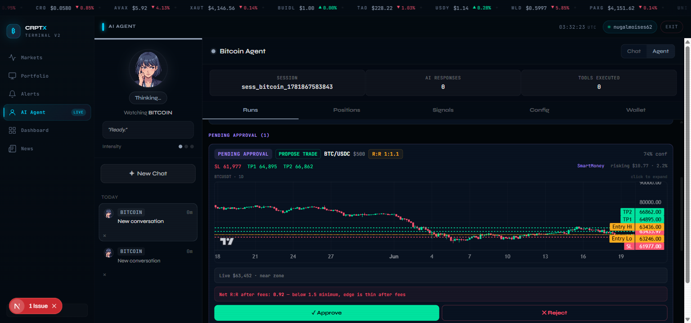
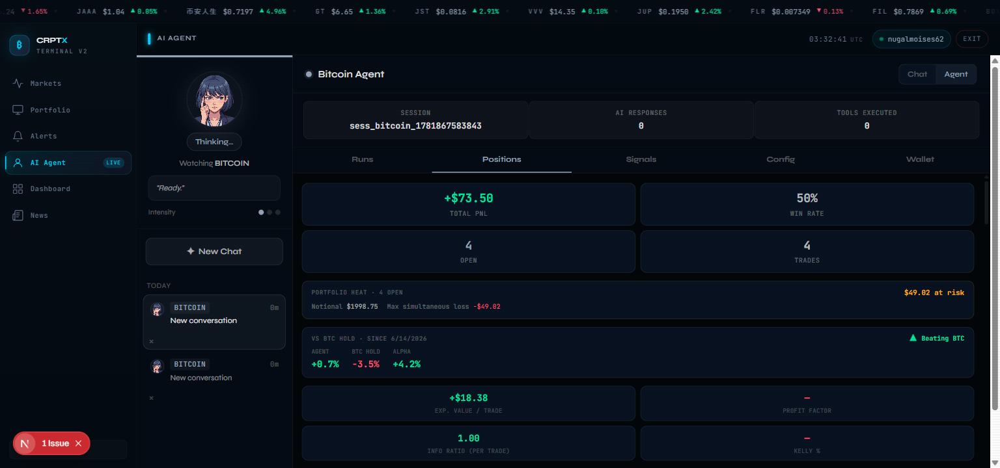
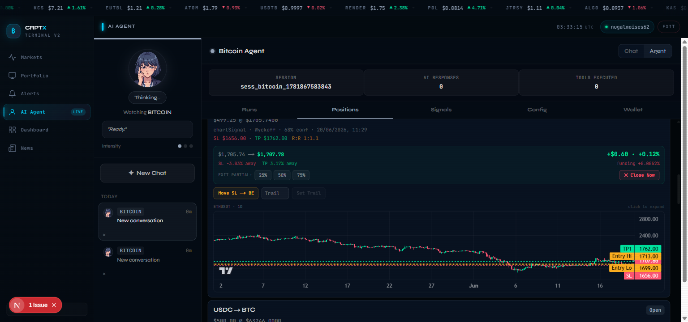
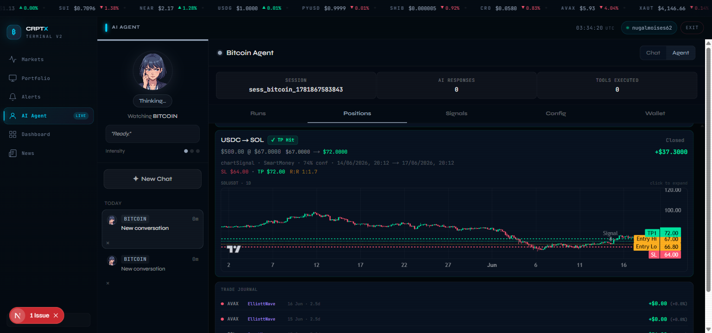
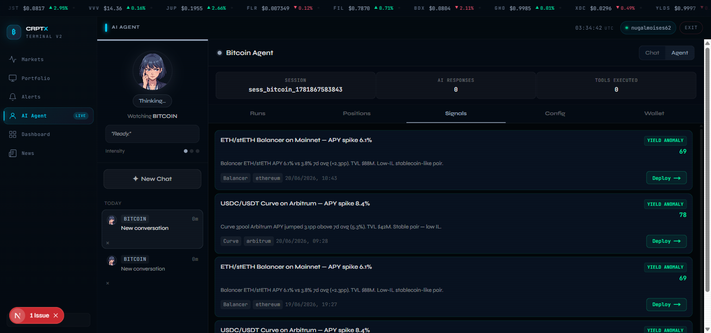
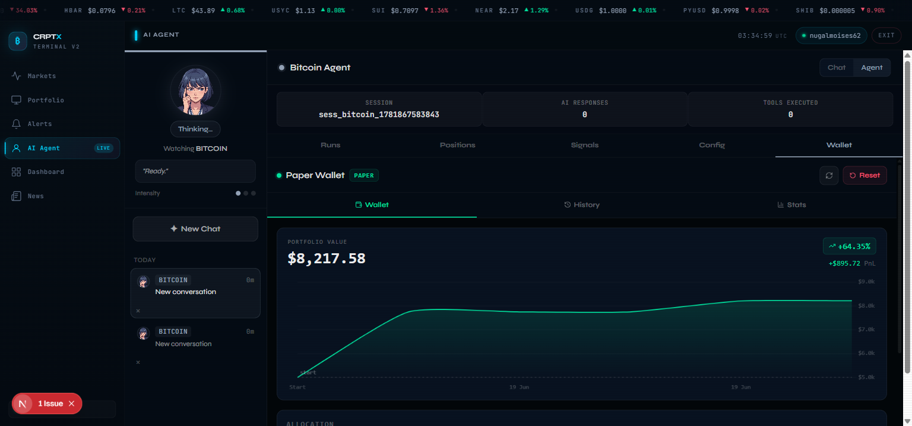

# CRPTX Terminal V2

An autonomous AI crypto trading terminal — live market data, a multi-framework analysis agent, paper trading engine with full position lifecycle, and a real-time dashboard built as a monorepo with Next.js + Express + Python.

---

## Screenshots

### Dashboard — Agent Runs & Intelligence Scanner


> Five seeded agent runs with `propose trade` / `no action` badges, wallet balances (USDC / BTC / ETH), and the Intelligence Scanner surfacing live SHORT windows on AAVE, AVAX, APT, ARB, SUI.

---

### Agent Run — Expanded Reasoning


> Expanded run card for BNB showing the agent's full Wyckoff Phase D LPS reasoning, confidence score, and intent breakdown.

---

### Agent Tab — Run Stats


> 10 total runs · 6 done · 4 in last 24 h · 3 blocked · 1 pending approval. Intent breakdown bar shows 8 propose-trade vs 2 no-action decisions.

---

### Pending Approval Card


> Full BTC approval card: TradingView candlestick chart annotated with TP1 / TP2 / Entry Hi–Lo / SL levels, live price near zone, R:R 1:1.1 at 74 % confidence. One-click Approve / Reject with fee-adjusted net R:R shown.

---

### Positions Tab — Statistics


> Total PnL **+$73.50** · Win rate 50 % · Portfolio heat $49 at risk. **vs BTC Hold since 6/14**: Agent +0.7 % vs BTC −3.5 % = **+4.2 % alpha**.

---

### Open Position — ETH Long with Live Chart


> Live ETH long: P&L +$8.60 (+0.12 %), annotated entry-zone chart, partial-exit buttons (25 % / 50 % / 75 %), Move SL → BE, and trailing-stop controls.

---

### Closed Position — SOL TP Hit


> SOL TP Hit: entry $57.00 → exit $72.00, R:R 1:1.7, **+$37.30** realised PnL in green. Trade journal at bottom.

---

### Signals Tab — Yield Opportunities


> Two seeded yield-anomaly cards: ETH/stETH Balancer (6.1 % APY spike, score 69) and USDC/USDT Curve Arbitrum (8.4 % APY spike, score 78) with protocol tags and one-click Deploy.

---

### Paper Wallet — Equity Curve


> Paper wallet: **$8,217.58** portfolio value, **+64.35 %** total return, +$895.72 PnL. Clean equity curve from start date — no major drawdowns.

---

## Architecture

```
my-app/
├── app/                        # Next.js 14 App Router (frontend)
│   ├── agent/                  # AI Agent chat + trading dashboard
│   ├── dashboard/              # Main market dashboard
│   ├── portfolio/              # Manual holdings tracker
│   ├── alerts/                 # Price alerts
│   ├── coins/[id]/             # Coin detail pages
│   └── news/                   # News feed
│
├── src/
│   ├── components/             # Reusable UI (charts, cards, modals)
│   ├── views/                  # Page-level view components
│   ├── controllers/            # React hooks (useAuth, useAlerts, etc.)
│   ├── services/               # Frontend API clients
│   └── models/                 # Frontend type models
│
└── services/
    ├── api/                    # Express + TypeScript backend
    │   └── src/
    │       ├── agents/         # Autonomous agent system
    │       │   ├── loop/       # Agent loop, position monitor, scheduler
    │       │   ├── coinAnalysis/  # Multi-framework analysis runner
    │       │   ├── memory/     # Vector-embedded agent memory
    │       │   ├── policy/     # Strategy engines + LLM prompts
    │       │   ├── skills/     # Technical analysis primitives
    │       │   └── tools/      # Read / act / chart tools
    │       ├── execution/      # Paper & live executors
    │       ├── risk/           # Risk engine, rules, config
    │       ├── routes/         # REST API routes
    │       ├── services/       # DB + external service layers
    │       ├── models/         # Mongoose schemas
    │       └── websocket/      # Socket.IO + Redis pub/sub
    │
    └── data/                   # Python data pipeline
        ├── app/workers/        # Celery tasks (OHLCV, order blocks, regime)
        └── Dockerfile
```

### Service map

```
Browser (Next.js :3000)
    │  REST + WebSocket
    ▼
Express API (:4000) ──► MongoDB Atlas
    │                        │
    ├── Agent Loop           └── Redis (:6379)
    │   (60 s sweep)              (pub/sub, cache)
    │
    └── Python Data Service (:8001)
        Celery Worker + Beat
        (OHLCV ingestion, order blocks, regime detection)
```

---

## Tech Stack

### Frontend
| Layer | Technology |
|---|---|
| Framework | Next.js 14 (App Router) |
| Language | TypeScript |
| Data fetching | TanStack React Query |
| Charts | Lightweight Charts (TradingView), Chart.js |
| Icons | Lucide React |
| Auth | JWT (access 15 min / refresh 7 d), stored in `localStorage` under `cd.access` / `cd.refresh` |

### Backend — API (`services/api`)
| Layer | Technology |
|---|---|
| Runtime | Node.js + Express |
| Language | TypeScript |
| Database | MongoDB Atlas (Mongoose) |
| Cache / Pub-Sub | Redis 7 |
| AI / LLM | OpenAI-compatible via OpenRouter (DeepSeek default) |
| Embeddings | `@huggingface/transformers` (local, `nomic-embed-text-v1.5`) |
| Auth | bcrypt + JWT (`jsonwebtoken`) |
| Real-time | Socket.IO + Redis subscriber |
| Rate limiting | `express-rate-limit` |
| Security | `helmet`, `hpp`, `xss-clean`, `cors` |
| Testing | Jest + `mongodb-memory-server` + Supertest |

### Backend — Data Pipeline (`services/data`)
| Layer | Technology |
|---|---|
| Runtime | Python 3.11 |
| Task queue | Celery + Redis broker |
| Scheduler | Celery Beat (persistent) |
| Data source | CoinGecko API (OHLCV, coin universe) |
| DeFi data | DeFiLlama (yield opportunities) |
| Storage | MongoDB Atlas |

### Infrastructure
| Component | Details |
|---|---|
| Containerisation | Docker Compose (redis, api, data, worker, beat) |
| MongoDB | MongoDB Atlas (external, set `MONGO_URL` in `.env.local`) |
| Redis | `redis:7-alpine`, volume-persisted |

---

## Features

### Autonomous Agent Loop
- Runs every 60 s per user session; configurable via UI
- Fetches primitives (OHLCV, order blocks, regime, sentiment, memory) in parallel
- Routes through 6 trading frameworks simultaneously
- Supports `requireManualApproval` (pauses for human sign-off) or full auto-execute

### Multi-Framework Analysis
| Framework | What it detects |
|---|---|
| **SmartMoney** | Order blocks, BOS, CHOCH, fair-value gaps, liquidity voids |
| **Wyckoff** | Accumulation / distribution phases (Phase A–E, LPS, PSY, UTAD) |
| **ElliottWave** | 5-wave impulse + 3-wave correction identification |
| **Harmonic** | Gartley, Bat, Butterfly, Crab, Cypher XABCD patterns |
| **ChartSignal** | Multi-timeframe momentum confluence |
| **YieldHunter** | DeFi APY anomaly detection via DeFiLlama |

### Position Lifecycle
```
propose_trade → pending (limit order) → open → partial exit (TP1 50%)
                                              → partial exit (TP2 40%)
                                              → runner (10%, trailing stop)
                                              → closed (SL / TP / manual / time-stop)
```

- **Limit orders**: wait for zone fill; cancelled if `entryExpiresAt` passes
- **Flash-crash SL detection**: fetches 1H candle low/high to catch SLs crossed intra-bar
- **Trailing stops**: server-side high-water-mark updated each 60 s sweep
- **TP1 scale-out**: 50 % exit credits wallet via `$inc` (survives TP2 full close)
- **Direction-aware**: every position carries `bias: 'long' | 'short'` for correct SL/TP polarity

### Risk Engine
| Control | Default | Description |
|---|---|---|
| `riskPerTradePct` | 1.0 % | Risk per trade as % of portfolio |
| `maxPortfolioHeatPct` | 5.0 % | Total open-risk cap; blocks new entries |
| `maxConcurrentPositions` | 6 | Hard cap on concurrent positions |
| `maxRiskPerTradeUsd` | $150 | Absolute dollar risk cap per trade |
| `maxDrawdownPct` | 10 % | Equity-curve circuit breaker |
| `dailyLossLimitPct` | 2 % | Daily loss limit, resets at 22:00 UTC |
| `maxNewPositionsPerDay` | 3 | Entry cap per trading day |

### Agent Memory System
- Writes structured memories after each completed analysis
- Embeddings generated locally via HuggingFace `nomic-embed-text-v1.5`
- Vector similarity search retrieves relevant past context per coin/session
- Reflection generator creates higher-level pattern summaries over time

### Intelligence Scanner
- Scans top coins continuously for trading windows
- Scores each coin across multiple signals (momentum, structure, volume, regime)
- Surfaces top SHORT / LONG opportunities sorted by composite score
- Filters by window duration (e.g. 180m, 240m, 360m windows)

### Chart Analysis Pipeline
- Two-tier pipeline: primitives → LLM interpretation
- Fetches OHLCV from CoinGecko (1D, 4H, 1H, 15m timeframes)
- Computes: RSI, MACD, Bollinger Bands, ATR, EMA stack, pivots, Fibonacci levels
- Detects: trend structure, order blocks, volume profile, Wyckoff phase, Elliott count
- Results stored in MongoDB and surfaced in the dashboard History tab

### Paper Wallet
- Simulated execution with realistic slippage model (base spread + size impact)
- 0.1 % taker fee on market fills, maker fee on limit fills
- Full trade history with realised PnL per fill
- Equity curve chart with vs-BTC-hold alpha comparison
- Reset button to restart from $10,000

### Real-time Feed
- Socket.IO server pushes price updates, agent status, and new run notifications
- Redis pub/sub decouples the agent loop from WebSocket delivery
- Ticker tape across all pages shows live prices for top 100 coins

---

## Agent Configuration (per user)

All settings are configurable from the **Config** tab in the UI:

```typescript
{
  enabled: boolean                 // master kill switch
  mode: 'paper' | 'cex' | 'onchain'
  loopIntervalMs: number           // default 60 000 ms
  strategies: {
    yieldHunter: boolean
    rebalance: boolean
    airdropWatch: boolean
    chartSignal: boolean
  }
  minSignalConfidence: number      // 0–100, default 55
  watchlist: string[]              // CoinGecko IDs
  maxTradeUsd: number
  requireManualApproval: boolean
  allowShorts: boolean
  riskPerTradePct: number          // 0.25–3.0
  maxPortfolioHeatPct: number
  maxConcurrentPositions: number
  maxRiskPerTradeUsd: number
  maxDrawdownPct: number
  dailyLossLimitPct: number
  maxNewPositionsPerDay: number
}
```

---

## API Reference

### Auth
| Method | Path | Description |
|---|---|---|
| `POST` | `/api/auth/register` | Create account |
| `POST` | `/api/auth/login` | Login → returns access + refresh tokens |
| `POST` | `/api/auth/refresh` | Rotate access token |
| `GET` | `/api/auth/me` | Validate session |

### Agent
| Method | Path | Description |
|---|---|---|
| `GET` | `/api/agent-runs` | List runs for session |
| `GET` | `/api/agent-runs/:id` | Single run detail |
| `POST` | `/api/agent-runs/:id/approve` | Approve a pending trade |
| `POST` | `/api/agent-runs/:id/reject` | Reject a pending trade |
| `GET` | `/api/agent-runs/config` | Get agent config |
| `PUT` | `/api/agent-runs/config` | Update agent config |

### Coin Analysis
| Method | Path | Description |
|---|---|---|
| `POST` | `/api/coin-analysis/run` | Trigger on-demand analysis |
| `GET` | `/api/coin-analysis` | List analysis runs |
| `GET` | `/api/coin-analysis/:id` | Single run detail with approval card |

### Positions
| Method | Path | Description |
|---|---|---|
| `GET` | `/api/positions` | List positions (open + closed) |
| `POST` | `/api/positions/:id/close` | Manual close |
| `POST` | `/api/positions/:id/partial-exit` | Partial exit (specify %) |
| `POST` | `/api/positions/:id/move-sl-be` | Move SL to breakeven |
| `POST` | `/api/positions/:id/set-trail` | Activate trailing stop |

### Paper Wallet
| Method | Path | Description |
|---|---|---|
| `GET` | `/api/paper-wallet` | Get wallet balances + history |
| `POST` | `/api/paper-wallet/reset` | Reset to $10,000 |
| `GET` | `/api/paper-wallet/stats` | PnL stats, equity curve |

### Market Data
| Method | Path | Description |
|---|---|---|
| `GET` | `/api/coins` | Top coins with live prices |
| `GET` | `/api/coins/:id` | Coin detail + OHLCV |
| `GET` | `/api/simple/price` | Live price lookup (CoinGecko proxy) |
| `GET` | `/api/news` | Latest crypto news |
| `GET` | `/api/intelligence` | Intelligence scan results |
| `GET` | `/api/order-blocks/:symbol` | Order blocks for symbol |

### Demo
| Method | Path | Description |
|---|---|---|
| `POST` | `/api/demo/seed` | Seed demo data (5 runs, 4 positions, memories, opportunities) |

---

## Getting Started

### Prerequisites
- Node.js 20+
- Docker + Docker Compose
- MongoDB Atlas account (free tier works)
- OpenRouter API key (for LLM — DeepSeek is cheap)
- CoinGecko API key (free tier)

### 1. Clone and install

```bash
git clone https://github.com/moi-script/crypt_dashboard
cd crypt_dashboard/my-app

# Frontend
npm install

# Backend
cd services/api && npm install && cd ../..
```

### 2. Environment variables

Create `my-app/.env.local`:

```env
# MongoDB Atlas connection string
MONGO_URL=mongodb+srv://<user>:<pass>@cluster.mongodb.net/crptx?retryWrites=true

# Redis (docker-compose provides this automatically)
REDIS_URL=redis://localhost:6379

# JWT signing secret — any long random string
JWT_SECRET=your-super-secret-jwt-key-here

# LLM provider (OpenRouter recommended)
OPENROUTER_API_KEY=sk-or-...
# or direct OpenAI
# OPENAI_API_KEY=sk-...

# CoinGecko (free tier: 30 req/min)
COINGECKO_API_KEY=CG-...

# DeepSeek (optional, cheaper alternative)
DEEPSEEK_API_KEY=...

# Frontend URL (for CORS)
WEB_URL=http://localhost:3000
```

### 3. Start infrastructure

```bash
# Starts Redis only (MongoDB is external via Atlas)
docker-compose up -d redis
```

### 4. Run services

```bash
# Terminal 1 — API (port 4000)
cd services/api && npm run dev

# Terminal 2 — Data pipeline (port 8001) — optional for full OHLCV ingestion
cd services/data && pip install -e . && uvicorn app.main:app --reload --port 8001

# Terminal 3 — Frontend (port 3000)
npm run dev
```

Open [http://localhost:3000](http://localhost:3000)

### 5. Docker (production)

```bash
docker-compose up --build
```

All services (api, data, worker, beat, redis) start together.

### 6. Seed demo data

After registering and logging in, call the seed endpoint to populate the UI with example runs, positions, memories, and opportunities:

```javascript
// In browser DevTools console (after login)
fetch('/api/demo/seed', {
  method: 'POST',
  headers: {
    'Authorization': 'Bearer ' + localStorage.getItem('cd.access')
  }
}).then(r => r.json()).then(console.log)
```

Expected response:
```json
{
  "ok": true,
  "seeded": {
    "agentRuns": 5,
    "positions": 4,
    "coinAnalysisRuns": 1,
    "strategyCards": 4,
    "memories": 3,
    "opportunities": 2
  }
}
```

---

## Testing

```bash
# Backend unit + integration tests
cd services/api
npm test

# Individual test suites
npm test -- --testPathPattern=positionMonitor
npm test -- --testPathPattern=coinAnalysis
npm test -- --testPathPattern=memory
```

Tests use `mongodb-memory-server` — no Atlas connection required.

---

## Key Design Decisions

**Why paper trading only by default?**
`mode: 'paper'` is hardcoded as the default. CEX / on-chain execution requires explicit opt-in, separate API key configuration, and small caps enforced at the risk engine level.

**Why `$inc` for realised PnL?**
TP1 partial exits credit the wallet before the full position is closed. Using `$inc` means a subsequent TP2 or SL close does not overwrite the TP1 credit — both deltas accumulate correctly.

**Why local embeddings?**
`nomic-embed-text-v1.5` runs entirely on-device via `@huggingface/transformers`. No embedding API cost, no data leaving the server, and latency under 50 ms per document on CPU.

**Why flash-crash SL detection?**
The position monitor sweeps every 60 s. A sharp wick can cross a SL and recover before the next sweep, leaving a losing position open. Fetching the 1H candle low/high on each sweep catches wicks that the live price comparison would miss.

**Why regime-adjusted framework thresholds?**
Framework win rates that are acceptable in trending markets become dangerous in ranging/choppy conditions. The policy engine softens disable thresholds in ranging regimes (30 %/20 % vs 35 %/25 %) to avoid cutting frameworks during low-volatility periods that naturally compress win rates.

---

## Repository

[https://github.com/moi-script/crypt_dashboard](https://github.com/moi-script/crypt_dashboard)
